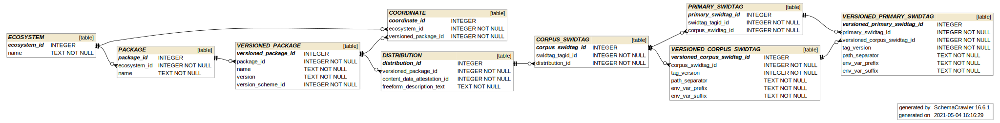
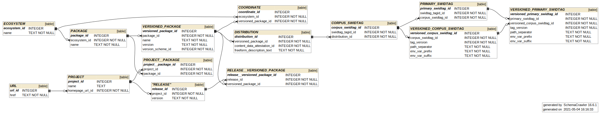

# SWIDREG data model mapping

SWIDREG introduces an information model for package managers.  A general terminology based on "Coordinates", tied to package manager ecosystems, is built in the SWIDREG project to populate SWID tags.

This file shows how the generic coordinate terminology maps to SWID tag components, and how ecosystem-specific terminology and fields map into the general model.

## Pluralities in the SWIDREG general model

The SWIDREG model's objective is to provide a SWID tag for every versioned package ecosystems provide through their installation and update mechanisms.  Through inspection of several ecosystems, we found these were the general one-to-many relationships that stem from an ecosystem and ultimately yield a versioned distribution:

* An [*ecosystem*](glossary.md#ecosystem) provides many [*packages*](glossary.md#package), represented as package series centered on a named, unversioned package.
* A [*package*](glossary.md#package) has many *versioned packages*.
* A *versioned package* has many [*distributions*](glossary.md#distribution) (e.g. builds for different machine architectures).
* A [*distribution*](glossary.md#distribution) has a *SWID tag* series, identified with a `tagId` that is unique to the series.
* A *SWID tag* series (whether for corpus or primary tags) has potentially several *versioned SWID tags*.  Multiple versioned SWID tags might exist for a single `tagId`.
* A *corpus SWID tag* represents a *distribution* as an installable payload.  When the software is installed, a *primary SWID tag* can be determined by measuring the installation footprint of the distribution within an operating environment.  *Primary SWID tags* may represent different files based on e.g. a change in operating system, so one *corpus SWID tag* may be tied to multiple *primary SWID tags*.

Further clarification on the terms above can be found in the [glossary](glossary.md), and has been linked where available.

The tables backing this general pattern are connected as illustrated in the following figure:

### Upstream projects

The SWIDREG model ties software to ecosystems.  A frequently necessary use case is seeking deployed software that has reported vulnerabilites that are independent of ecosystems.  The SWIDREG model ties these to upstream [*Projects*](glossary.md#project) that are independent of ecosystems:

* A [*project*](glossary.md#project) has many [*releases*](glossary.md#release).
* A [*release*](glossary.md#release) can be tied to many *versioned packages*, noting that some ecosystems apply patches as part of the packaging process.  These patch-sets may induce multiple versions per release.

The following figure updates the above figure to include how releases tie to packages.

Please note that the information of how a versioned package ties to a release is not guaranteed to be discoverable from ecosystem metadata.

## SWID tag components and the SWIDREG general model

This table shows how model components are mapped into a SWID tag.  SWID components are identified by XPath relative to the root `<SoftwareIdentity>` element.  References to `*_SWIDTAG` table are meant to apply to one of the `CORPUS_SWIDTAG` or `PRIMARY_SWIDTAG` tables, depending on context.

| SWID component | Model component | Table-column |
| -------------- | --------------- | ------------ |
| `/@name` | Package name | `VERSIONED_PACKAGE.name` |
| `/@version` | Package version | `VERSIONED_PACKAGE.version` |
| `/@versionScheme` | Version scheme | `VERSION_SCHEME.name` |
| `/@tagId` | Persisted, randomly-generated SWID tag series identifier | `SWIDTAG_TAGID.tag_id` |
| `/@tagVersion` | Incrementing version identifier for the SWID tag within its series | `VERSIONED_*_SWIDTAG.tag_version` |
| `/@corpus` | Corpus SWID tag use-case designation | Implied by usage of `*_SWIDTAG` table. |
| `Entity/@regid` | Minimized URL (home page or email address, favoring home page) of discovered entity | `MINIMAL_REGID.regid` |
| `Entity/@role="aggregator"` | Ecosystem maintainer, typically declared copyright holder | `SWID_ENTITY_ROLE.name = 'aggregator'` |
| `Entity/@role="maintainer"` | Recorded maintainer(s) |  `SWID_ENTITY_ROLE.name = 'maintainer'` |
| `Entity/@role="softwareCreator"` | Recorded author(s) | `SWID_ENTITY_ROLE.name = 'softwareCreator'` |
| `Payload/@n8060:pathSeparator` | Recorded path separator for tag | `VERSIONED_*_SWIDTAG.path_separator` |
| `Payload/@n8060:envVarPrefix` | Recorded variable prefix for tag | `VERSIONED_*_SWIDTAG.env_var_prefix` |
| `Payload/@n8060:envVarSuffix` | Recorded variable suffix for tag | `VERSIONED_*_SWIDTAG.env_var_prefix` |
| `Payload/Directory` | Root directory of a payload tree, designated "apex" to distinguish from file system absolute root | `PAYLOAD_APEX_DIRECTORY` |
| `File/@name` | Base name of file | `FILE.basename` |
| `File/@size` | Size of file contents | `FILE.filesize` and `CONTENT_DATA.content_size` |
| `File/@SHA256:hash` | SHA-256 hash of file contents | `CONTENT_DATA.sha256` |
| `File/@SHA512:hash` | SHA-512 hash of file contents | `CONTENT_DATA.sha512` |

## Ecosystem concepts mapping into the SWIDREG general model

The table above mapped the information model to SWID tag components.  However, the table above does not show how one populates the general information with data from any one ecosystem.  The following table shows how metadata in some ecosystems maps into the model.  (Note that this is somewhat a pivot: Columns in the following table map to rows in the above table.)  This table from ecosystem to general model also serves to disambiguate some terms, such as the general model's term "Package" mapping in Debian to the concept of "Binary package", as opposed to Debian's "Source package".  The glossary notes other [ecosystem-specific synonyms](glossary.md#package-synonyms).

| Ecosystem | (n/a layer) | Package name | (n/a layer) | Versioned package | Distribution |
| --------- | ----------- | ------------ | ----------- | ----------------- | ------------ |
| cpan      | (n/a) | Module name | (n/a) | Module version | Distribution |
| debian    | Source package | Binary-package name | (n/a) | Binary-package version | TODO |
| maven     | Group | Artifact ID | Project | Project-version | Project package |
| pypi      | (n/a) | Project distribution name | (n/a) | Release | Distribution |

A future update to this documentation may include the NPM and RubyGems ecosystems.
